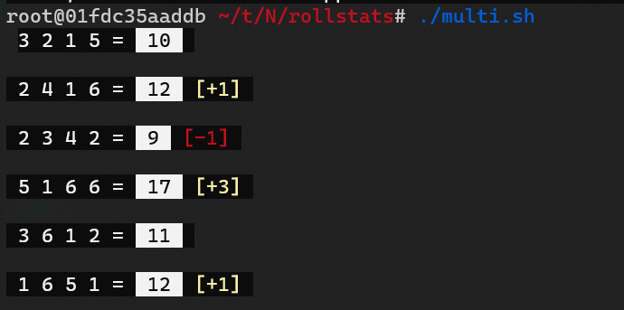

## What this does

This will perform a standard Dungeons & Dragons ability score roll simulating 4d6 with the lowest dropped and calculating your bonus.
It runs as a stateful program on the Algorand blockchain. Has a few ANSI colors to enhance the output.
You can try it out with the included scripts that call `goal` if you have an Algorand node or sandbox setup.

I use **`fish` shell, so that is required** with these exact scripts (not hard to modify them for bash). You will need the `gpp` program installed.
Also, before running, you will need to **first set the environment variable `$APP_CREATOR`**.

You will also need to **install a JSON processing program called `jq` first**.

```shell
./init.sh
```

```shell
./multi.sh
```

## How

It is written in [Tealang](https://github.com/pzbitskiy/tealang), also using the GPP macro preprocessor.  The macros are helpful to conserve instruction executions, since stateful programs
on the Algorand blockchain only get a maximum of 700 instructions executed.

The "random" function is the simplest thing I could come up with that sort of worked. I'm not sure it even qualifies as pseudo-random though.  There are limited cycles left, but it may be possible to make it slightly better.

## Why?

Not to offend anyone, but the most accurate technical term is "pure fuckery".

Note: The new version of Tealang is a work in progress, and has a lot of gotchas at the moment I am writing this.  But they seem to be working
diligently to update it to the new AVM version.  A lot of stuff already works if you are careful.
